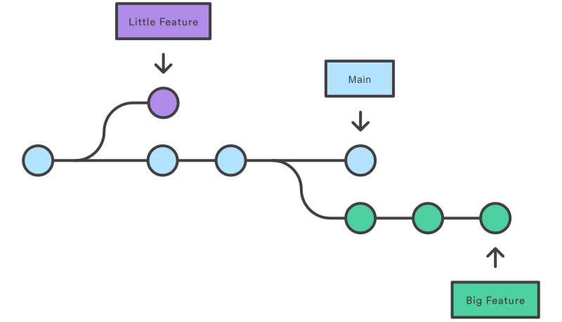

# **Git**

## **1. Giới thiệu về __`Git`__**
- Git là một hệ thống __quản lý phiên bản__

- Git cung cấp __kho lưu trữ (repository)__ để chứa toàn bộ lịch sử phiên bản
- Ưu điểm: tốc độ nhanh, đơn giản, phù hợp với tất cả dự án.
- Ví dụ khi Khi sử dụng Facebook hay nhiều ứng dụng khác, bạn sẽ thấy chúng thường xuyên cập nhật phiên bản: hôm nay là 1.1.1, ngày mai lên 1.1.2, rồi 1.1.3, 1.1.4,... Những bản cập nhật này giúp sửa lỗi hoặc thêm tính năng mới. Tuy nhiên, đôi khi phiên bản mới lại phát sinh lỗi - ví dụ, bạn cập nhật xong thì trang đăng ký bị lỗi, trong khi trước đó nó vẫn hoạt động bình thường. Trong những trường hợp như vậy, việc quay lại phiên bản cũ là rất quan trọng. Nhờ có hệ thống quản lý phiên bản (version control), bạn có thể xem lại lịch sử các phiên bản trước, biết được thay đổi nào đã được thực hiện, và dễ dàng khôi phục lại phiên bản ổn định trước đó.
- Link cài đặt: https://git-scm.com/downloads


## **2. Các thuật ngữ trong __`Git`__**
 ```
 Working directory     Staging area         Repository
        |                   |                    |
        |----- git add ---->|                    |
        |                   |---- git commit --->|
        |                   |                    |
        |                   |                    |
        |                   |                    |
 ```
- __`Working directory`__ (Thư mục làm việc): Khu vực chứa toàn bộ mã nguồn của dự án mà chúng ta đang làm việc. Nó chính là thư mục bạn mở trong IDE (như IntelliJ, VS Code) hoặc trình chỉnh sửa văn bản (text editor).
  
- __`Staging area`__ (Khu vực sắp xếp): Staging area (Khu vực sắp xếp): Đây là nơi tạm lưu các thay đổi của file trước khi bạn chính thức lưu vào lịch sử Git. Bạn có thể xem nó như một bản nháp, nơi bạn chuẩn bị các thay đổi trước khi "chốt" chúng vào kho lưu trữ (repository).
- __`Repository`__ (Kho lưu trữ): Đây là nơi lưu trữ toàn bộ mã nguồn và lịch sử các phiên bản của dự án. Nó giúp bạn theo dõi, quay lại các phiên bản trước và làm việc nhóm dễ dàng hơn.
  > **Ví dụ:**
  >   - Working directory (Thư mục làm việc):
  >     Bạn bắt đầu code cả trang Giới thiệu và trang Liên hệ trong IDE của mình (VS Code, IntelliJ,...). Đây là nơi bạn trực tiếp chỉnh sửa nội dung các file HTML.
  >   - Staging area (Khu vực sắp xếp):
  >     Sau khi code xong, bạn cảm thấy cả hai trang đều tạm ổn, nên dùng lệnh __`git add`__ để đưa cả file gioi-thieu.html và file lien-he.html vào vùng staging. Đây là nơi bạn chuẩn bị mọi thứ trước khi "đóng gói" lại.
  >   - Khách hàng kiểm tra và phản hồi. Họ bảo rằng trang Giới thiệu đã OK, không cần chỉnh sửa gì. Nhưng trang Liên hệ thì chưa ổn, cần sửa lại nội dung.
  >   - Quay lại Working directory để chỉnh sửa:
  >     Bạn quay lại thư mục làm việc để chỉnh sửa lại file lien-he.html theo góp ý của khách hàng. Sau khi sửa xong, bạn dùng __`git add`__ lien-he.html để cập nhật bản sửa mới lên vùng staging.
  >   - Staging area cập nhật:
  >     Lúc này vùng staging đã có: gioi-thieu.html (vẫn là bản cũ đã ổn) và lien-he.html (bản mới vừa sửa)
  >   - Repository (Kho lưu trữ):
  >     Cuối cùng, bạn dùng __`git commit`__ để tạo một phiên bản mới chứa cả hai file. Git sẽ lưu lại toàn bộ lịch sử thay đổi, bao gồm cả lần bạn sửa lại trang Liên hệ. Nhờ vậy, bạn có thể dễ dàng xem lại hay quay về phiên bản trước nếu cần.

## **3. Các câu lệnh __`Git`__**
#### 3.1. __`git --version`__
  - Xem phiên bản hiện tại đang được cài trên máy tính

#### 3.2.__`git init`__
  - Khởi tạo repository (kho lưu trữ) cho dự án.
  - Chạy câu lệnh trong thư mục gốc của dự án.
  - Mỗi một dự án phải khởi tạo 1 repository (kho lưu trữ) cho dữ án
  - Thư mục .git là một thư mục ẩn nằm trong thư mục gốc của mỗi repository Git trên máy tính của bạn. Đây là nơi Git lưu trữ tất cả dữ liệu quan trọng để theo dõi các thay đổi trong mã nguồn, như lịch sử các lần commit, cấu hình của repository, và thông tin khác liên quan đến phiên bản của dự án.
#### 3.3. __`git status`__
  - Để xem trạng thái của những file đã được thay đổi trong dự án.
#### 3.4. __`git add ten_file`__ hoặc __`git add .`__
  - Chuyển các file đã thay đổi từ vùng Working sang vùng Staging
  - Staging area có tác dụng sắp xếp lại những file đã thêm vào.
  - __`git add .`__ để đẩy tất cả các file ở vùng __`working directory`__ sang vùng __`Staging area`__
#### 3.5. __`git commit -m "Nội dung… "`__
  - Chuyển các file từ vùng Staging sang vùng Repository
  - Repository có tác dụng tạo ra 1 phiên bản mới.
#### 3.6. __`git log`__
  - Xem lại lịch sử các commit.
  - commit mới sẽ hiện bên trên, commit cũ sẽ hiện bên dưới.
#### 3.7. __`git show commit_id`__
  - Dùng để xem chi tiết một commit.
#### 3.8. __`git diff`__
  - Xem sự thay đổi của một file sau khi chỉnh sửa.
  - Điều kiện là file đó vẫn đang ở khu vực Working.
#### 3.9. __`git checkout -- ten_file`__
  - Bỏ đi những thay đổi của file, để file đó trở về như lúc ban đầu.
  - Áp dụng cho file đang ở vùng Working.
  - khôi phục file tên_file về trạng thái trong lần __commit gần nhất (latest commit) trên nhánh hiện tại__. Nói cách khác, nó __xóa toàn bộ thay đổi chưa commit__ trong file đó và làm cho file quay trở lại trạng thái như khi bạn vừa mới commit lần cuối.
#### 3.10. __`gitk`__
  - Mở dashboard xem trực quan hơn.
#### 3.11. __`git reset ten_file`__ hoặc __`git reset .`__
  - Chuyển file đó từ vùng Staging trở lại vùng Working.
  - __`git reset .`__ chuyển __tất cả__ các file từ vùng Staging trở lại vùng Working.
#### 3.12. __`git reset --soft commit_id`__
  - Chuyển từ trạng thái đã commit về trạng thái trước lúc chạy lệnh git commit.
  - Tức là từ Repository về lại Staging.
  - __`commit_id`__ là id của phiên bản cũ hơn so với phiên bản cần chuyển lại về vùng staging
#### 3.13. __`git reset --mixed commit_id`__
  - Chuyển từ trạng thái đã commit về trạng thái trước lúc chạy lệnh git add.
  - Tức là từ Repository về lại Working.
  - __`commit_id`__ là id của phiên bản cũ hơn so với phiên bản cần chuyển lại về vùng staging


## **4. Nhánh trong __`Git`__**



#### 4.1. __`git branch`__
  - Xem danh sách các nhánh.

#### 4.2. __`git checkout -b ten_nhanh`__
  - Tạo một nhánh mới và chuyển sang nhánh đó.
  - Nhân bản nhánh chính thành một nhánh mới với toàn bộ mã nguồn giống như nhánh chính.

#### 4.3. __`git checkout ten_nhanh`__
  - Tạo một nhánh mới và chuyển sang nhánh đó.

#### 4.4. __`git merge ten_nhanh`__
  - Để hợp nhất nhánh khác vào trong nhánh hiện tại.
  - Phải đứng từ nhánh mà đang muốn kéo code về

#### 4.5. __`git branch -D ten_nhanh`__
  - Để xóa nhánh.
  - Phải đứng từ nhánh khác để xóa nhánh mà ta đang cần xóa
