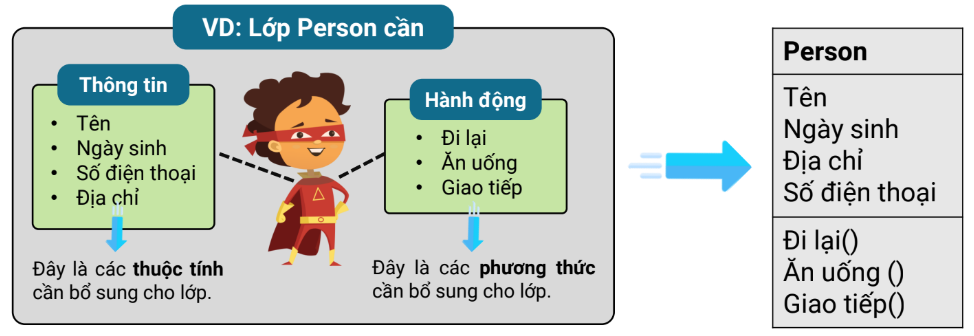

# **LẬP TRÌNH HƯỚNG ĐỐI TƯỢNG**

🤖 Hướng đối tượng - Object Oriented Programming hay OOP là một mô hình lập trình quan trọng, được ứng dụng rộng rãi trong phát triển phần mềm. OOP tập trung xoay quanh dữ liệu và đối tượng thay vì tập trung vào thủ tục và hàm như các mô hình lập trình truyền thống.

## **1. __Lớp (Class)__ và __đối tượng (Object)__**
- Hai khái niệm quan trọng trong lập trình hướng đối tượng là: __Lớp (Class)__ và __Đối tượng (Object)__.

- __Class__ giống như 1 kiểu dữ liệu, còn __Object__ giống như biến của kiểu dữ liệu đó, nhiệm vụ của bạn là phải đi xây dựng __Class__ cho riêng mình, sau khi xây dựng xong __Class__, tức là bạn đã có 1 kiểu dữ liệu mới, bạn có thể khai báo ra nhiều đối tượng thuộc kiểu dữ liệu đó.
- Mục tiêu của OOP đó là cố gắng đưa các thực thể, đối tượng trong thực tế vào phần mềm.
- Phần mềm cần quản lý những đối tượng như Người, Xe, Sách thì khi đó, chúng được xây dựng trong phần mềm dưới dạng các lớp. Lớp chính là bản mô phỏng của một đối tượng trong thực tế.
- Lớp có nhiệm vụ phác họa, mô phỏng những thông tin chung còn khái niệm về đối tượng của lớp lại là một thực thể cụ thể của lớp đó.
  > Ví dụ:
  > Bạn cần xây dựng một lớp là Person để mô phỏng con người thì khi đó một đối tượng của lớp Person là “Nguyễn Văn Tèo” chính là một thực thể, một đối tượng của lớp Person.

## **2. __Attribute__ và __Method__**

- Để mô tả thông tin của một lớp (Class), bạn cần thêm các thuộc tính (Attribute) và phương thức (Method).

- Thuộc tính (Attribute) là những thông tin mà lớp sở hữu. Ví dụ: Một khách hàng có thể có các thông tin như họ tên, mã khách hàng, giới tính, số điện thoại, email,...
- Phương thức (Method) là những hành động mà đối tượng của lớp có thể thực hiện. Ví dụ: Khách hàng có thể đăng nhập, đăng ký,...
